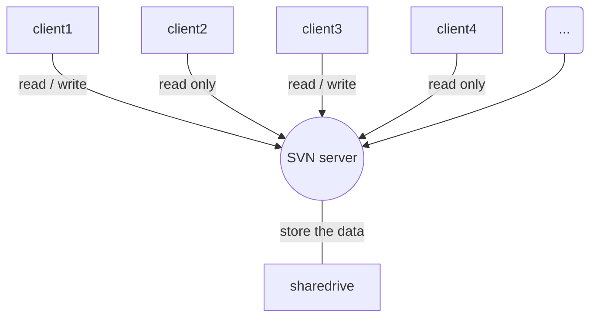

# 标题
## 标题
### 标题

一级标题
=
二级标题
-

>引用
>
>引用

## 加粗
**粗体**
*斜体*

## 多层嵌套
>aaaaaa
>>bbbbbbb
>>>ccccc

## 插入链接
[百度](https://www.baidu.com/)

## 图片
![df][01]
[01]:https://timgsa.baidu.com/timg?image&quality=80&size=b9999_10000&sec=1548688722885&di=6aeccfd333a86c51b574ae5310f03657&imgtype=0&src=http%3A%2F%2Fimg.mp.itc.cn%2Fupload%2F20170526%2Ffff3cde171b64d65a0f63338f0613ff0_th.jpg '描述'

## 序表
### 有序
1. one
2. two

### 无序
* one
* two
- three

## 代码
	第一段
	第二段

## 表格

| 字段一        |         字段二 | 字段三 |
| ------------- |:-------------:| -----:|
| col 3 is      | right-aligned | $1600 |
| col 2 is      | centered      |   $12 |
| zebra stripes | are neat      |    $1 |

***
---
* * *
- - -

